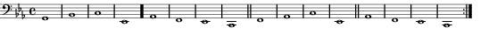
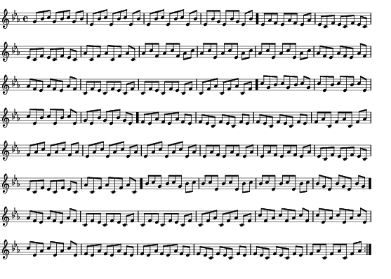
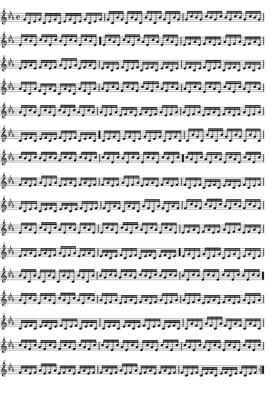
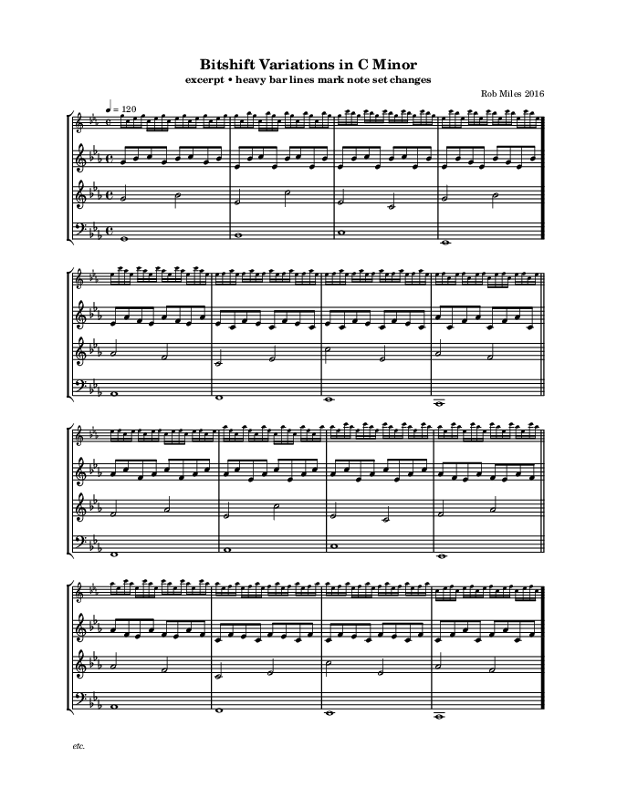

# The Science of the Bit Fiddle

An analysis of Rob Miles's 2016
*Bitshift Variations in C Minor*.

- [Introduction](#introduction)
- [Laboratory](#laboratory)
- [Sawtooth Sound](#sawtooth-sound)
- [Notes and Tuing](#notes-and-tuning)
- [Voices](#voices)
- [Voice Variation](#voice-variation)
- [The Period](#the-period)
- [Harmony](#harmony)
- [Closing Remarks](#closing-remarks)

## Introduction

In 2016 Rob Miles [published][code] a very short program
called *Bitshift Variations in C Minor* and presents it
in a [YouTube movie][intro]. Here is a copy if his program:

```text
echo "g(i,x,t,o){return((3&x&(i*((3&i>>16?\"BY}6YB6%\":\"Qj}6jQ6%\")[
t%8]+51)>>o))<<4);};main(i,n,s){for(i=0;;i++)putchar(g(i,1,n=i>>14,12
)+g(i,s=i>>17,n^i>>13,10)+g(i,s/3,n+((i>>11)%3),10)+g(i,s/5,8+n-((i>>
10)%3),9));}"|gcc -xc -&&./a.out|aplay
```

Paste this into a terminal on your Linux system and listen.
Or listen to the [recording at SoundCloud][sound].
It starts with one slow-moving voice. A second, faster voice enters.
Then a third and even a fourth voice! It has the mechanical charms
of chiptune music of the 1980ies, sure, but be aware that it is
only 210 bytes of C code that generate this infinite stream of
[PCM][pcm] sound!

It is **magical**. Absolutely **fascinating**.

And it prompts investigation. The author, Rob Miles, explains
his feat partially in a [YouTube movie][intro]. This article
goes into the details and provides some background.

[intro]: https://www.youtube.com/watch?v=MqZgoNRERY8
[code]: http://txti.es/bitshiftvariationsincminor
[sound]: https://soundcloud.com/robertskmiles/bitshift-variations-in-c-minor
[pcm]: https://en.wikipedia.org/wiki/Pulse-code_modulation

## Laboratory

Create a shell script, say *bitfiddle.sh*, and paste the original code.
Refactor and reformat so that the code looks like this:

```sh
cat << EOT | gcc -xc - && ./a.out | aplay
g(i,x,t,o){...}
main(i){for(i=0;;i++){putchar(...);}}
EOT
```

For better readability, use **[cat][cat]** with a [here document][here]
instead of **[echo][echo]** with a long argument.
The two middle lines are the C code we want to investigate.
The first line compiles and runs this code, sending its output to
the speaker: `-xc` tells the compiler **[gcc][gcc]** that the language
is C (since it reads from _stdin_, it cannot deduce the language from
the file extension); **[a.out][aout]** is the compiled program file;
and **[aplay][aplay]** sends unsigned 8bit sample data from _stdin_
to the speaker at a rate of 8000 Hz (the default; command line
arguments could be used to change sample format and sample rate).

[cat]: https://linux.die.net/man/1/cat
[echo]: https://linux.die.net/man/1/echo
[gcc]: https://gcc.gnu.org/
[here]: https://en.wikipedia.org/wiki/Here_document
[aout]: https://en.wikipedia.org/wiki/A.out
[aplay]: https://linux.die.net/man/1/aplay

Stretch out the terse C code a bit, so it looks like this:

```sh
cat << EOT | gcc -xc - && ./a.out | aplay
g(i,x,t,o){
  return (3&x&(i*((3&i>>16?\"BY}6YB6%\":\"Qj}6jQ6%\")[t%8]+51)>>o))<<4;
}
main(i,n,s){
  for(i=0;;i++)
    putchar(
      g(i, 1,       n=i>>14,        12)
      +
      g(i, s=i>>17, n^i>>13,        10)
      +
      g(i, s/3,     n+((i>>11)%3),  10)
      +
      g(i, s/5,     8+n-((i>>10)%3), 9)
    );
}
EOT
```

Now start experimenting:

- Run the code and listen to the music.
- Comment all but one of the `g(...)` lines and listen.
- Set the second parameter to `0` for one or several of
  the `g(...)` lines.
- Modify the last parameter to `g(...)` and listen.

We find that there are four voices playing at different speeds and
octaves. The `g()` function is the PCM generator, adding voices is
mixing them, and `i` is the clock.

## Sawtooth Sound

This aspect of the program is partially explained in the movie.
Sawtooth sound is easy to generate:

```sh
cat << EOT | gcc -xc - && ./a.out | aplay -r 8000 -f U8
main(i) { for (i=0;;i++) putchar(i); }  /* 0..255 */
EOT
```

While `i` constantly increases, **[putchar][putchar]** outputs only
the low 8 bits of `i` or `i&255` (technically, it casts `i` to an
unsigned char), such that after 255 follows 0 (not 256). The result,
when played at 8000 Hz, is a very low 8000/256=31 Hz sound.

[putchar]: https://linux.die.net/man/3/putchar

We need a way to control frequency and amplitude.
The next few snippets are alternatives for the middle
line in the script above.

Here masking (bitwise and, `&`) and bit shifting (`<<` and `>>`)
enter the scene. Shifting left is multiplying by powers of
two, and shifting right is dividing by powers of two.
Note that masking has lower precedence than bit shifting,
so that `63&i<<2` means `63 & (i<<2)`.

(1) Two octaves higher (`i<<2` or 4 times the frequency):

```C
main(i) { for (i=0;;i++) putchar(i<<2); }  /* 0 to 252 in steps of 4 */
```

(2) Same frequency, lower amplitude:

```C
main(i) { for (i=0;;i++) putchar(63&i); }  /* 0..63 in steps of 1 */
```

(3) Amplify to original amplitude:

```C
main(i) { for (i=0;;i++) putchar((63&i)<<2); }  /* 0 to 252 in steps of 4 */
```

(4) Make the sawtooth curve more staircase shaped: `i>>1` grows at
half the speed of `i`, so it takes two steps of `i` until anything
can change. The result is the sequence 0 0 8 8 16 16 .. 248 248:

```C
main(i) { for (i=0;;i++) putchar((31&i>>1)<<3); }  /* 0 0 8 8 16 16 .. 248 248 */
```

(5) Taking the staircase to the extreme: with `i>>4` (`i` div 16) it
takes 16 steps of `i` until the curve jumps to the next flight; masking
with 3 wraps around at multiples of 4, so to keep amplitude (volume)
we multiply with 64 (or left shifting by 6):

```C
main(i) { for (i=0;;i++) putchar((3&i>>4)<<6); }  /* 0:16 64:16 128:16 192:16 */
```

Two key things to note from the examples above:

1. Masking increases frequency but decreases volume  
   (63=00111111<sub>2</sub>, 31=00011111<sub>2</sub>, 3=00000011<sub>2</sub>).

2. Bitshifting before masking changes the octave (frequency);  
   bitshifting after masking changes the volume (amplitude).

The last two examples have the same frequency and amplitude as
the third example, but different shapes. In the last example,
after masking with 3 there are only four possible values: 0, 1, 2, 3.
Left shifting by 6 yields: 0, 64, 128, 192.
Because of the right shift by 4 (div 16) the actual sequence of
values is 16 times 0, 16 times 64, 16 times 128, 16 times 192,
16 times 0 etc. This is more a staircase than a sawtooth,
and indeed the last two examples differ in timbre, though
not in pitch and not in volume.

To achieve intervals other than octaves we have to multiply
the base frequency by values other than powers of two.
For example, the perfect fifth is at 3/2 of the base frequency.
Because here we deal with integers only, we cannot multiply by 1.5
but instead multiply by 3 and divide by 2 (by right shifting).

(6) Let's say this plays a C:

```C
main(i) { for (i=0;;i++) putchar((3&(i>>3))<<6); }
```

(7) Then this plays a G because it is at 3/2 of the frequence
of example (6); we divide by two by shifting right one more:

```C
main(i) { for (i=0;;i++) putchar((3&(i*3>>4))<<6); }
```

(8) We arrive at this overall structure of a simple PCM sound
generator, where *n* is the note (pitch), *o* the octave, and
*v* the volume:

```C
for (i=0;;i++) putchar( (3 & (i*n >> o)) << v );
```

And indeed this is exactly what we can find in Rob Miles's
code, at least after some refactoring.

After some refactoring and letting *v* = 4, we can find this
very structure in Rob Miles's code:

```C
g(i,x,t,o){
  char *m = 3&(i>>16)?"BY}6YB6%":"Qj}6jQ6%"; // melodic material
  int n = m[t%8] + 51;                 // note (pitch indicator)
  return (3 & x & (i*n >> o)) << 4;    // amplitude at time i
}
```

The actual values passed in for *o* are 9, 10, and 12, which is
large enough to compensate for the small mask of 3 (two leftmost bits)
and the large values for *n* (pitch indicator, see next section).

The maximum value returned by this generator is 48 (`3<<4`), so
that the maximum value for the four voices added is 192 (`4*48`)
and indeed `putchar` will never have to wrap around.

## Notes and Tuning

The magic strings `"BY}6YB6%"` and `"Qj}6jQ6%"`
relate to the notes (pitches) being played:

```text
 Char | '%' | '6'  | 'B'  | 'Q'  | 'Y'  | 'j'  | '}' |
ASCII |  37 |  54  |  66  |  81  |  89  | 106  | 125 |
  +51 |  88 | 105  | 117  | 132  | 140  | 157  | 176 |
Ratio |  1  | 1.19 | 1.32 | 1.50 | 1.59 | 1.78 |  2  |
      | 1/1 | 6/5  | 4/3  | 3/2  | 8/5  | 16/9 | 2/1 | (just intonation)
 Note |  C  |  Eb  |  F   |  G   |  Ab  |  Bb  |  C' | (C minor)
```

We find that, when 51 is added to the ASCII values of the characters
in the strings, the ratios approximate the frequency ratios of [just
intonation][ji] ([reine Stimmung][rs]). If we take `'%'` for a C, then
we get the notes of a C minor scale (missing is D at 9/8 = 1.12 or `'0'`).

[ji]: https://en.wikipedia.org/wiki/Just_intonation
[rs]: https://de.wikipedia.org/wiki/Reine_Stimmung

Let's turn from sound generation to the creation of music.

## Voices

We now look at the four voices generated by the code.
In this section, all references to absolute time duration
assume playback at 8192 Hz, which is very close to the
actual playback at 8000 Hz but yields nice figures.

Recall the PCM generator with its four parameters
*i* = time, *x* = on/off, *t* = pitch index, *o* = octave:

```C
g(i,x,t,o){
  char *m = 3&(i>>16)?"BY}6YB6%":"Qj}6jQ6%"; // melodic material
  int n = m[t%8] + 51;                 // note (pitch indicator)
  return (3 & x & (i*n >> o)) << 4;    // deflection at time i
}
```

The “magic strings” are **two sets of notes**:

1. `"BY}6YB6%"`  corresponds to  F A♭ C' E♭ A♭ F E♭ C
2. `"Qj}6jQ6%"`  corresponds to  G B♭ C' E♭ B♭ G E♭ C

The expression `3&(i>>16)` in the `g` function chooses between
the two sets: it is the sequence 0 1 2 3 0 1 2 3 etc and progresses
every 2<sup>16</sup>=65536 increments of `i` or about every 8 seconds.
Zero (false) maps to the second set, whereas 1 2 3 (all true) map to
the first set. Both sets have 8 notes and are indexed by `t%8`
so that values t≥8 wrap around.

Therefore, we get notes from the second set for 8 seconds,
then notes from the first set for 24 seconds.

The main function, after some refactoring, looks like this:

```C
main(i,n,s){
  for(i=0;;i++){
    n = i>>14;  // increments every 2 secs
    s = i>>17;  // increments every 16 secs
    putchar(
      g(i, 1,     n,             12)  // 1st voice in 1/1
    + g(i, s,     n^(i>>13),     10)  // 2nd voice in 1/2 (after 16")
    + g(i, s/3,   n+((i>>11)%3), 10)  // 3rd voice in 1/8 (after 48")
    + g(i, s/5, 8+n-((i>>10)%3),  9)  // 4th voice in 1/16 (after 1'20")
    );
  }
}
```

Now it is simple to see that `n` increments every 2<sup>14</sup>=16384
steps of `i` or about every 2 seconds. Similarly, `s` increments every
2<sup>17</sup>=131072 steps of `i` or about every 16 seconds.

### First Voice

The first voice is controlled by `n`, which increments every
2 seconds. Within the `g` function, the current set of notes is
indexed by `n%8`, so that we get the 1st half of the 2nd set,
the 2nd half of the 1st set, then the entire 1st set, before
the melody repeats:

```text
seq%8:  |: 0 1  2  3  : 4  5 6  7 : 0 1  2  3  : 4  5 6  7 :|
  set:     ----2nd---   ---1st---   ---1st----   ---1st---
notes:  |: G B♭ C' E♭ : A♭ F E♭ C : F A♭ C' E♭ : A♭ F E♭ C :|
```



It is the base line and repeats every **32 seconds**.
The heavy bar line marks the change between the two
note sets.

### Second Voice

The second voice is controlled by `n^(i>>13)`, which changes
once every second (2<sup>13</sup>=8192). It is in half notes
relative to the first voice and it starts only after 16 seconds,
when `s` first changes from 0 to 1. What melody does it produce?

The values that index the note sets are `(i>>14)^(i>>13)`, that is,
the xor of a value and twice that value, essentially `a^b` where
*b=2a* (or a=b/2) for increasing values of *a*. Writing the binary
representations for small values of *a*, *b*, and *a^b* we find:

```text
    a=b/2  b=2a   a^b    dec.  mod 8

    0000   0000   0000     0     0
    0000   0001   0001     1     1
    0001   0010   0011     3     3
    0001   0011   0010     2     2

    0010   0100   0110     6     6
    0010   0101   0111     7     7
    0011   0110   0101     5     5
    0011   0111   0100     4     4

    0100   1000   1100    12     4
    0100   1001   1101    13     5
    0101   1010   1111    15     7
    0101   1011   1110    14     6

    0110   1100   1010    10     2
    0110   1101   1011    11     3
    0111   1110   1001     9     1
    0111   1111   1000     8     0
```

(It turns out that this is a [Gray code][graycode],
which have the property that exactly one bit changes
between successive numbers in binary representation.)

Remember that the “magic strings” are indexed by `[t%8]`,
so only the least significant 3 bits of the Gray code
are used, and this bit sequence is an endless repetition
of the “mod 8” column above.

Since each note lasts one second, the first eight notes
are pulled from the 2nd set, the following 24 notes are
pulled from the 1st set. The generated melody, in halves
(relative to the first voice) is as shown below and has
a period of **32 seconds**. Again, the heavy bar line
marks the change between the note sets.

```text
seq%8:  |: 0  1  3  2  6  7  5  4  : 4  5  7  6  2  3  1  0 :|
notes:  |: G  B♭ E♭ C' E♭ C  G  B♭ : A♭ F  C  E♭ C' E♭ A♭ F :
           F  A♭ E♭ C' E♭ C  F  A♭ : A♭ F  C  E♭ C' E♭ A♭ F :|
```


[graycode]: https://en.wikipedia.org/wiki/Gray_code

### Third Voice

The third voice is controlled by `n+((i>>11)%3)`, which changes
about 4 times a second (`i>>11` ≡ `i/2048`), so it is in eighth
relative to the first voice. It starts after about 48 seconds,
when *s/3* first changes from 0 to 1.

The expression `(i>>11)%3` generates the repeating sequence 0, 1, 2.
To this the value of `n` (which increments every 2 seconds) is added.
The period of `n+((i>>11)%3)` (mod 8) is the least common multiple
of 3 (the repeating 0 1 2) and 64 (the length of `n%8` in eighth),
which is 192 eighth or 24 bars or **48 seconds**. However, because
the note set selection sequence (2nd 1st 1st 1st) repeats every
32 seconds or 128 eighth, the third voice has a period of lcm(192,128)
= 384 eights or 48 bars or **96 seconds**. Here is the beginning of
the sequence (`i'` is `(i>>11)%3` and `+` is addition modulo 8):

```text
M  2-----------------------------------------------------------------
n  0 . . . . . . .  1 . . . . . . .  2 . . . . . . .  3 . . . . . . .
i' 0 1 2 0 1 2 0 1  2 0 1 2 0 1 2 0  1 2 0 1 2 0 1 2  0 1 2 0 1 2 0 1
+  0 1 2 0 1 2 0 1  3 1 2 3 1 2 3 1  3 4 2 3 4 2 3 4  3 4 5 3 4 5 3 4
   G b C'G b C'G b  e b C'e b C'e b  e b C'e b C'e b  e b G e b G e b

M  1-----------------------------------------------------------------
n  4 . . . . . . .  5 . . . . . . .  6 . . . . . . .  7 . . . . . . .
i' 2 0 1 2 0 1 2 0  1 2 0 1 2 0 1 2  0 1 2 0 1 2 0 1  2 0 1 2 0 1 2 0
+  6 4 5 6 4 5 6 4  6 7 5 6 7 5 6 7  6 7 0 6 7 0 6 7  1 7 0 1 7 0 1 7
   e a F e a F e a  e C F e C F e C  e C F e C F e C  a C F a C F a C

M  1-----------------------------------------------------------------
n  8 . . . . . . .  9 . . . . . . .  10. . . . . . .  11. . . . . . .
i' 1 2 0 1 2 0 1 2  0 1 2 0 1 2 0 1  2 0 1 2 0 1 2 0  1 2 0 1 2 0 1 2
+  1 2 0 1 2 0 1 2  1 2 3 1 2 3 1 2  4 2 3 4 2 3 4 2  4 5 3 4 5 3 4 5

M  1-----------------------------------------------------------------
n  12. . . . . . .  13. . . . . . .  14. . . . . . .  15. . . . . . .
i' 0 1 2 0 1 2 0 1  2 0 1 2 0 1 2 0  1 2 0 1 2 0 1 2  0 1 2 0 1 2 0 1
+  4 5 6 4 5 6 4 5  7 5 6 7 5 6 7 5  7 0 6 7 0 6 7 0  7 0 1 7 0 1 7 0
```

And this is the complete 3rd voice, with its distinctive tripel
rhythm generated by `%3` that overlays the even beats of the two
lower voices. The beaming shows one possible rhythmic interpretation.



### Fourth Voice

The fourth voice is controlled by `8+n-((i>>10)%3)`, which
changes about 8 times a second, so it is in sixteenth relative
to the first voice. It starts after about 1'20" when *s/5* first
changes from 0 to 1.

`(i>>10)%3)` generates the repeating sequence 0 1 2, as in the
third voice, but twice as fast, and 16 times as fast as does `n`.

`i>>10` increments 4 times as fast as does `n`, so
`n-((i>>10)%3)` yields 5 times 0 -1 -2, plus a single 0
(16 notes), before `n` increases and we get 5 times
0 -1 1 plus a single 0, etc. Adding 8 avoids negative
numbers. And after mod 8 we find a sequence that starts
as shown below. Again, after 8 seconds or 64 sixteenth
the note set changes from `"Qj..."` to `"BY..."` and
after another 24 seconds again back to `"Qj..."`. This
fourth voice is a lively, though somewhat nervous, descant.

```text
0  7  6  0  7  6  0  7  6  0  7  6  0  7  6  0
G  C  E♭ G  C  E♭ G  C  E♭ G  C  E♭ G  C  E♭ G

0  7  1  0  7  1  0  7  1  0  7  1  0  7  1  0
G  C  B♭ G  C  B♭ G  C  B♭ G  C  B♭ G  C  B♭ G
```

The period is the least common multiple of the duration of
the `0 -1 -2` sequence (3 sixteenth) and the `n%8` sequence
(128 sixteenth), or 384 sixteenth, as in the third voice.
However, as the fourth voice plays at twice the speed of the
third, the cycle through the note sets (2nd 1st 1st 1st)
takes 256 sixteenth (32 seconds), the period is lcm(384,256)
or 768 sixteenth 48 bars or **96 seconds** (same as 3rd voice).



## Voice Variation

The sound generator function `g` takes a parameter `x` that
controls when a voice starts, but not only: `3&x` serves as
the “sawtooth mask”. Because of the bitwise and with `3`,
there are only four possible mask values: `00`, `01`, `10`,
`11` (binary). This is what we hear:

- `00` – voice off
- `01` – softer, higher octave
- `10` – medium, lower octave
- `11` – louder, lower octave

Assuming `n=1` and `o=0` in the refactored `g` function
(and remembering the `<<4` (times 16) amplification),
it generates the following PCM signals:

- `00` – generates `0 0 0 0` (repeat)
- `01` – generates `0 16 0 16` (repeat)
- `10` – generates `0 0 32 32` (repeat)
- `11` – generates `0 16 32 48` (repeat)

The `x` parameter is used by the four voices as follows:

**Voice 1:** Always 1, so the base line is soft (and an octave
higher than we'd assumed).

**Voice 2:** Uses `x = s`, so we have (a) 16 seconds silence,
before we hear (b) the 2nd half of the melody (bar 9 starting
with an F), then (c) the 1st half of the melody, louder and
in the lower octave, then (d) again the 2nd half with full body.
Then the cycle repeats.

**Voice 3:** Uses `x = s/3` (integer division) so that the
3rd voice goes through the same off/soft/medium/full cycle
as the 2nd voice, but at one third of the speed: each phase
lasts 48 seconds. The melodic period of the 3rd voice is
96 seconds, so we “miss” the first half, hear softly the
2nd half, followed by a loud 1st half, then more gently
again the 2nd half.

**Voice 4:** Uses `x = s/5` so the 4th voice, like the 2nd
and the 3rd, goes through the off/soft/medium/full cycle,
but each phase now lasts 80 seconds.

## The Period

Periods of the melodies have been indicated before.
In combination with voice variation we get these results:

- Voice 1: melodic period is 32 seconds, voice does not
  vary, so we get an overall period of **32 seconds**.

- Voice 2: melodic period is 32 seconds, voice variation
  period is 4×16 seconds, overall period is **64 seconds**.

- Voice 3: melodic period is 96 seconds, voice variation
  period is 4×48 or 192 seconds, overall period is
  **192 seconds**.

- Voice 4: melodic period is 96 seconds, voice variation
  is 4×80 or 320 seconds. The least common multiple yields
  an overall period of **960 seconds**.

The **overall period** of the piece is **960 seconds**
or **16 minutes** or 30 times the baseline (voice 1) or
7,864,320 increments of `i`. This can be checked by ear
by changing `for(i=0;;i++)` to `for(i=7864320;;i++)` in
the code.

## Harmony

Looking at the two sets of notes, we find that each contains
the notes of a minor seventh chord:

- `"BY..."` consists of F A♭ C E♭ or Fm<sup>7</sup>
- `"Qj..."` consists of C E♭ G B♭ or Cm<sup>7</sup>

Shared between the two sets are C and E♭, the D is missing from both.

[](doc/notesets.pdf)

In this view, the *Bitshift Variations* boil down to 8 seconds
of Cm<sup>7</sup> jingling followed by 24 seconds of Fm<sup>7</sup>
jingling. The dissonant intervals can and do occur, but
will be softened by other voices that tend to “fill” the
minor seventh chord.

## Closing Remarks

The music generated is not super complex, but quite effective.
Knowing how little code it takes to generate both the music
and the sound—this makes it so astonishing.

Remember, this was all integer arithmetics, no floating point.
Much of the terseness derives from exploiting C's operator
precedence rules by omitting needless parentheses. Indeed,
two more parens and one semicolon could be omitted, sparing
another two (sic) bytes. The arguments to main are really
just local variables declared using as little code as possible.

Valentino Braitenberg coined the “law of downhill synthesis
and uphill analysis” in his 1986 book *Vehicles*. Does it
always hold? I found this article to be a *fun* analysis of
a *fascinating* synthesis: *Bitshift Variations in C Minor*
by Rob Miles (2016).

## Appendix

### Score Exceprt

This is how *Bitshift Variations in C Minor* “look like” (excerpt):
[](doc/score.pdf)

### Times

The tune is played at 8000 samples per second, the default
sampling rate of the **aplay** tool. Since this is about
2<sup>13</sup> = 8192, we get the following clock divisors
and corresponding frequencies and note values:

```text
    Divisor        Frequency             Note Value
i>>10    i/1024    8 times per second    sixteenth
i>>11    i/2048    4 times per second    eighth
i>>12    i/4096    2 times per second
i>>13    i/8192    once per second       half
i>>14   i/16384    two seconds           whole
i>>15   i/32768   
i>>16   i/65536
i>>17  i/131072    16 seconds
```

### Notes on C

The default type is `int`, both for parameters and function
return values. Therefore, `main(i)` is short for `int main(i)`,
and similarly for `g(i,x,t,o)`.

Bitshift variations in C minor uses the following C operators,
which appear hear ordered form highest precedence (tightest
binding) to least:

```text
   [ ]        index
 *  /  %      multiplicative
  +   -       additive
 <<   >>      bitshift
    &         bitwise AND
    ^         bitwise XOR
    |         bitwise OR
    =         assignment
```

From this table we deduce that:

```C
n^i>>13  =  n^(i>>13)  =  n ^ (i/8192)
3&i>>16  =  3&(i>>16)  =  11b & (i/65536)
```
